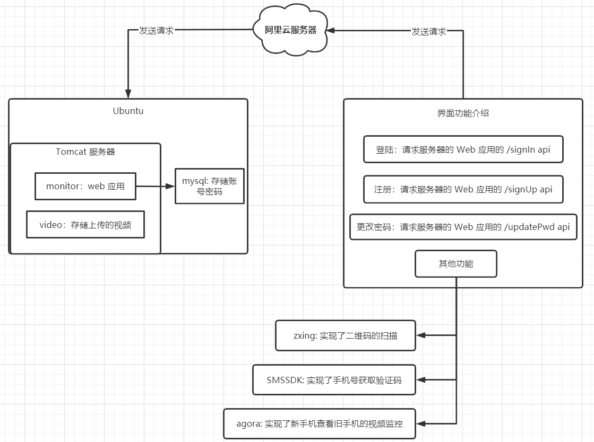
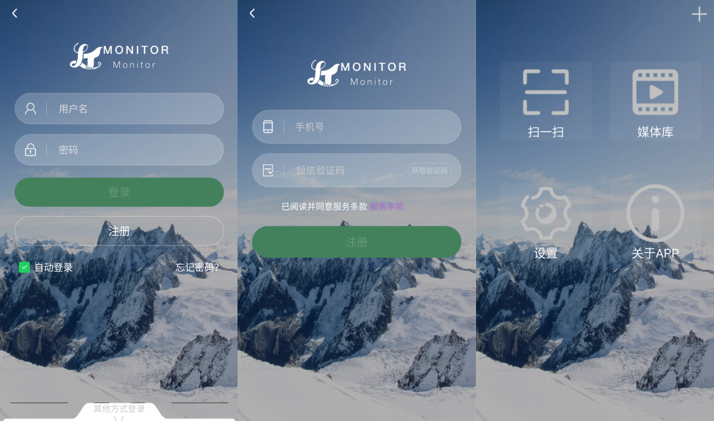

# Second use of Android Phones

- **起序：新手触碰 `Android开发` 领域，有望大佬指点。**

### 一、为什么想做这个项目?

> 这也许是一个比较令人深省的问题，可能是突发奇想，一时兴起，也可能是锻炼自己在 **`Android开发`** 领域的能力。虽然这不是一个特别新颖的想法，但在 **资源回收利用** 方面还是有那么一点能力体现的 。新手机的快速迭代更新使得一部分人对最新版手机有更高的使用期望，这就造成了这部分人原来使用的手机会被 **搁浅** ，而这些手机 **最终的去处也各式各样** ，可能被 **尘封、低价卖出、当板砖 **。以上纯属个人 YY，下面进入正题。

### 二、简介

>项目主要二次利用 Android 系统比较旧版本的手机，把旧手机的摄像头当作 **监控摄像头**，利用视频聊天的方式，在旧手机上安装一个 **APP (AndMon)** 录取视频，在其他手机上安装一个 **APP (Monitor)** 接收旧手机的视频流，这个功能是在 **Monitor** 通过 **扫一扫二维码** 的形式进而实现监控的目的。在 **AndMon** 上同时存在着 **录制视频** 的功能，录制的视频可以上传到 **阿里云服务器上** ，然而可以在 **Monitor** 上的 **媒体库** 选项中查看录制好的视频。

### 三、框架

> 项目难免会用到第三方框架实现一些 **自己觉得看似牛逼** 但常用的功能，虽然不是自己编写的，但读懂第三方框架简单实现的代码也是一种能力，对不对。

- **[SMSSDK](http://www.mob.com/mobService/sms) : 实现了手机号获取验证码**
- **[zxing](https://github.com/zxing/zxing) : 实现了二维码的扫描**
- **[agora](https://www.agora.io/cn/) : 实现了新手机查看旧手机的视频监控**

**注：这三个框架功能强大，我只是利用了部分功能，还有其他功能需要发掘使用，在这里不细说。**

### 四、架构图解

### 五、页面展示

### 六、总结

**初步窥探 Android 开发的流程，Android 领域很庞大。借用孙中山大大的一句话。**

